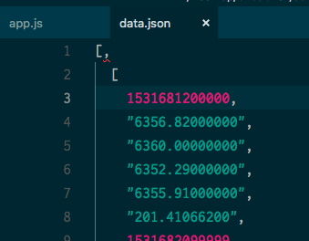

## Binance Backtesting Data

## Start

`node app.js 15m`

## Other Intervals

```
1m
3m
5m
15m
30m
1h
2h
4h
6h
8h
12h
1d
3d
1w
1M
```

## Note!

### _remove the comma!!_



## Source

`https://github.com/binance-exchange/binance-official-api-docs/blob/master/rest-api.md#klinecandlestick-data`
